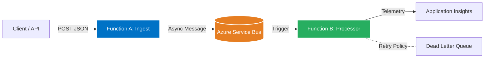

# Azure-Native Resilient Data Orchestrator 🚀


A production-grade, event-driven data pipeline built on Azure using **Infrastructure as Code (Terraform)** and **GitHub Actions**. This system demonstrates distributed system patterns (Publisher/Subscriber), resilience via chaos engineering, and deep observability.

## 💡 The Problem & The Solution

### The Challenge: "The Fragile Pipeline"

In modern data engineering, simple request-response architectures fail at scale. When high-volume data bursts hit a system, or a downstream dependency (like a database or API) goes offline, traditional "monolithic" pipelines suffer from:

- **Data Loss:** Dropped requests during downtime.
- **Cascading Failures:** One slow service backing up the entire system.
- **The "Black Box" Effect:** Lack of visibility into where a specific record failed in a distributed flow.

### The Solution: "Resilient Orchestration"

This project implements the **Asynchronous Request-Reply** and **Retry with Exponential Backoff** patterns to ensure data integrity. By decoupling ingestion from processing via Azure Service Bus, the system can:

- **Buffer Pressure:** Absorbing traffic spikes without overloading compute resources.
- **Self-Heal:** Automatically retrying transient failures without manual intervention.
- **Provide Auditability:** Every "job" is tracked via a unique Correlation ID across service boundaries.

## 🏗️ Architecture Overview

The system decouples data ingestion from processing using an asynchronous message bus, allowing it to handle burst traffic without crashing.



## ✨ Key Engineering Features

### 🛠️ Distributed Infrastructure (IaC)

- **100% Terraform Managed:** No "Click-Ops." Every resource, from Service Bus namespaces to Application Insights, is defined as code.
- **Identity-Based Security:** Uses Managed Identities (RBAC) instead of connection strings for service-to-service communication.

### 🛡️ Resilience & Fault Tolerance

- **Chaos Simulation:** A built-in "Chaos Engine" within the Processor function simulates transient 500-level errors to test the infrastructure's durability.
- **Dead Letter Queue (DLQ) Management:** Messages that fail after max retries are safely shunted to a DLQ for inspection, preventing data loss.

### 📊 Professional-Grade Telemetry

- **Distributed Tracing:** Implements Operation_Id tracking across Functions to see the full end-to-end journey of a data packet.
- **Custom Metrics:** Tracks "Job Processing Latency" and "Success-to-Failure Ratios" to simulate a real-world production dashboard.

### 🚀 Enterprise CI/CD

- **Automated Lifecycle:** GitHub Actions handles the terraform plan/apply and .NET build/deploy in a unified, gated pipeline.
- **OIDC Authentication:** Secure, passwordless deployment to Azure.

## 📸 Evidence & Observability

- **Application Map:** Visual proof of the flow from Ingest -> Queue -> Worker.
- **End-to-End Transaction Details:** Deep dive into how a single request propagates through the system.
- **Resilience Logs:** Logs showing the system failing, retrying, and eventually succeeding (or DLQ-ing).

## 🚀 How to Run

### Prerequisites

- An active Azure Subscription.
- GitHub Repository with Secrets configured (see [docs/DEPLOYMENT.md](docs/DEPLOYMENT.md)).

### Triggering the Pipeline

You can trigger the system by sending an HTTP POST request to the Ingest Endpoint.

Using curl:

```bash
curl -X POST <YOUR_FUNCTION_URL>/api/IngestJob \
   -H "Content-Type: application/json" \
   -d '{"JobId": "demo-1", "OperationType": "ETL", "DataSizeKB": 500}'
```

(Replace `<YOUR_FUNCTION_URL>` with your actual Azure Function URL)

## 📂 Documentation Links

- [Architecture Deep Dive](docs/ARCHITECTURE.md)
- [Deployment & CI/CD](docs/DEPLOYMENT.md)
- [Troubleshooting Guide](docs/TROUBLESHOOTING.md)
- [Quick Reference](docs/QUICK_REFERENCE.md)
- [Documentation Index](docs/DOCUMENTATION.md)

---
