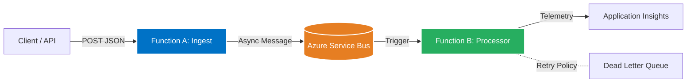

# Azure-Native Resilient Data Orchestrator 🚀


A production-grade, event-driven data pipeline built on Azure using **Infrastructure as Code (Terraform)** and **GitHub Actions**. This system demonstrates distributed system patterns (Publisher/Subscriber), resilience via chaos engineering, and full observability.

## 🏗️ Architecture Overview

The system decouples data ingestion from processing using an asynchronous message bus, allowing it to handle burst traffic without crashing.



Key Features

- **Infrastructure as Code:** 100% of Azure resources provisioned via Terraform.

- **Event-Driven:** Uses Azure Service Bus for asynchronous decoupling.

- **Chaos Engineering:** `ProcessJob` function randomly simulates failures to demonstrate Azure's automatic retry policies and Dead Letter Queue handling.

- **Observability:** Distributed tracing and custom metrics using Application Insights.

- **Secure CI/CD:** Automated pipelines for Plan, Apply, and Deploy using OIDC/RBAC authentication.

🚀 How to Run
### Prerequisites
- An active Azure Subscription.
- GitHub Repository with Secrets configured (see docs/DEPLOYMENT.md).

### Triggering the Pipeline
You can trigger the system by sending an HTTP POST request to the Ingest Endpoint.

Using curl:

```bash
curl -X POST <YOUR_FUNCTION_URL>/api/IngestJob \
   -H "Content-Type: application/json" \
   -d '{"JobId": "demo-1", "OperationType": "ETL", "DataSizeKB": 500}'
```
(Replace <YOUR_FUNCTION_URL> with your actual Azure Function URL)

📸 Evidence & Observability
- **Distributed Tracing (Application Map):** Shows the flow of data from Ingest -> Queue -> Worker.
- **Resilience in Action:** Shows intentional failures being caught and retried automatically.

📂 Documentation Links
- [Architecture Deep Dive](docs/ARCHITECTURE.md)
- [Deployment & CI/CD](docs/DEPLOYMENT.md)
- [Troubleshooting Guide](docs/TROUBLESHOOTING.md)
- [Quick Reference](docs/QUICK_REFERENCE.md)
- [Documentation Index](docs/DOCUMENTATION.md)

---
