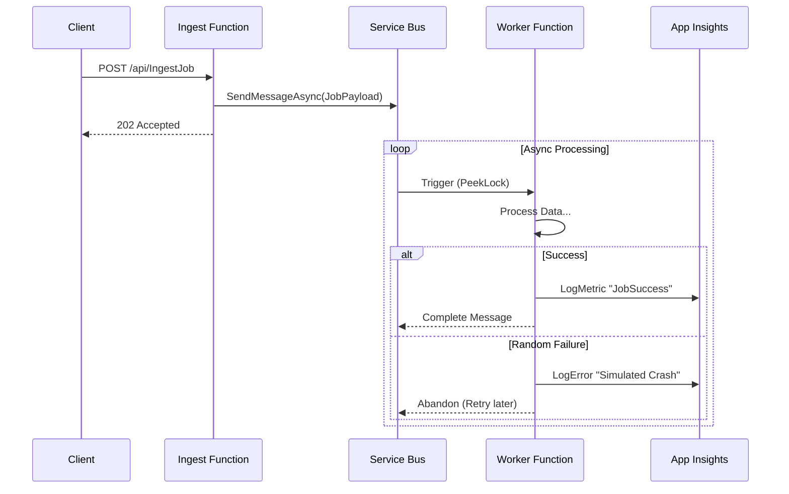

# 🏛️ System Architecture

This document outlines the design decisions and components of the Data Orchestrator.

## Components

### 1. Ingest Service (`IngestJob`)
* **Type:** Azure Function (HTTP Trigger)
* **Responsibility:** Acts as the API Gateway. It accepts JSON payloads, validates them, and immediately offloads them to the queue.
* **Why?** This ensures the API responds quickly (`202 Accepted`) to the client, even if the actual data processing takes a long time.

### 2. Message Broker (Azure Service Bus)
* **Type:** Enterprise Message Queue
* **Responsibility:** Buffers messages between the Ingest and Worker services.
* **Why?** Provides **Load Leveling**. If 1,000 requests hit the Ingest API at once, the Service Bus holds them safely until the Worker can process them, preventing system crash.

### 3. Worker Service (`ProcessJob`)
* **Type:** Azure Function (Service Bus Trigger)
* **Responsibility:** Reads messages from the queue and performs the "heavy lifting" (simulated by `Task.Delay`).
* **Resilience:** Configured with random failure injection (Chaos Engineering) to test retry logic.

---

## Data Flow Diagram

---

If you need a diagram exported as PNG or SVG, generate it from the mermaid blocks above (e.g., use mermaid.live or VS Code mermaid preview).